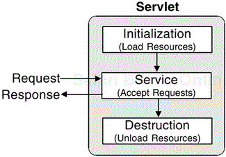
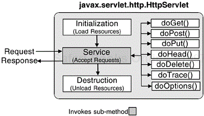

# Java/Jakarta EE Technology
## Basic Concepts
**What are the key features of Java Servlets?**
**Introduction**
Java Servlets are a key technology for building dynamic web applications, providing a robust API, object-orientated programming, and platform neutrality.

**What are Java Servlets?**
Java Servlets are small programs that execute on the server, dynamically extending the functionality of a web server. They are used to create dynamically generated content that is then served to the client. Servlets are highly portable and can be used in a variety of different server environments, with the only requirements being that the server support the JVM and a servlet container.

**Servlet Life Cycle**
The life cycle of a servlet is controlled by the Web container in which the servlet has been deployed. When a Web user makes a request, the container performs the following steps: loads the servlet class if an instance of the servlet does not exist, creates an instance of the servlet class, calls the init() method of the servlet to initialize an instance of the servlet, invokes the service method using a request and response object as input parameters, and calls the destroy() method when the servlet object needs to be removed from the Web container.

**Servlet Interface**
A Servlet is an implementation of the javax.servlet.Servlet interface. The Servlet interface defines lifecycle methods to initialize a Servlet, process requests, and destroy a Servlet. However, the usual way to use the Servlet interface is not by directly implementing the interface, but by subclassing an abstract implementation of the Servlet interface.

**Example Code**
```java
import javax.servlet.*;
import java.io.*;

public class HelloWorldServlet extends HttpServlet {
    public void doGet(HttpServletRequest request, HttpServletResponse response)
        throws ServletException, IOException {
        response.setContentType("text/html");
        PrintWriter out = response.getWriter();
        out.println("<h1>Hello World!</h1>);    
    }
}
```

## Servlet Life Cycle
The Servlet life cycle consists of three phases: initialization, service, and destruction. The initialization phase is used to load resources, the service phase is used to provide service to multiple client requests, and the destruction phase is used to destroy loaded resources when the Servlet is taken out of service.

**Initialization Phase**
The initialization phase is the first phase of the Servlet life cycle, and it is used to load resources that the Servlet needs to service requests. The init() method is called only once during the Servlet's life cycle, and it is used to create and initialize resources such as database connections.
```java
public void init(ServletConfig config) throws ServletException {
    //Create and initialize resources
}
```

**Service Phase**
The service phase is the 2nd phase of the Servlet life cycle, and it is used to provide service to multiple client requests. The service() method is called for each HTTP request, and it is responsible for generating the response to the request.
```java
public void service(ServletRequest req, ServletResponse res) throws ServletException, IOException) {
    // Generate response to the request
} 
```

**Destruction Phase**
The destruction phase is the third and final phase of the Servlet life cycle, and it is used to destroy loaded resources when the Servlet is taken out of service. The destroy() method is called when the Servlet is being removed from use by a container, allowing the Servlet to gracefully terminate and tidy up any resources it might have created.
```java
public void destroy() {
    // Destroy loaded resources
}
```

**Multithreading and Synchronization**
Servlets typically run inside multithreaded servlet containers that can handle multiple requests concurrently. The service() method is called on a separate thread for each request, requiring careful synchronization to ensure thread safety. This can be achieved by using the synchronized keyword with the service method, which handles requests one at a time in a serialized manner.

**Service Method Signature and Parameters**
The service() method has the following signature: `public void service(ServletRequest request, ServletResponse response) throws ServletException, IOException`. The servlet container passes a ServletRequest object and a ServletResponse object, which contain the client's request and the servlet's response, respectively.

**Example Code**
```java
public void service(ServletRequest request, ServletResponse response) throws ServletException, IOException {
    // Get the request and response objects
    HttpServletRequest httpRequest = (HttpServletRequest) request;
    HttpServletResponse httpResponse = (HttpServletResponse) response;

    // Process the request and generate the response
    // ...
}
```

## Servlet Container
**Session**
A session in a Servlet container is a mechanism for maintaining state between visits, allowing the servlet to store and retrieve information about a client's current session.

**Session Creation and Management**
A session is created when a servlet or JSP invokes the getSession() method, and the generated ID is sent back to the client either as a Cookie or by using URL re-writing. The HttpSession object acts as a container for other objects that make up the session state, with methods for adding, getting, and removing these objects. Sessions can be used to store and access contextual information regarding a user's interaction with a web application, such as user-specific objects and session attributes.

**Session Tracking**
Sessions can be tracked using various technique, including cookie-based tracking and URL rewriting. Cookie-based tracking involves storing the session ID is a cookie on the client's browser, while URL rewriting involves appending the session ID to the URL. The Servlet container manages session tracking, and the developer does not need to worry about the details of how it is accomplished.

**Session Attributes and Events**
Sessions can have attributes associated with them, which are stored as state information in the request related to the session. The HttpSession interface provides methods for getting and setting session attributes, as well as for listening to events related to the session, such as when an attribute is added or removed.

**Session Timeout and Invalidation**
Sessions can be configured to timeout after a certain period of inactivity. When a session times out, the HttpSession object is invalidated, and any associated attributes are removed. The developer can also explicitly invalidate a session using the invalidate() method.
```java
// Example of creating a session and setting an attribute
HttpSession session = request.getSession();
session.setAttribute("username", "johnDoe");
```

```java
// Example of getting a session attribute
String username = (String) session.getAttribute("username");
```


Figure 1-1. Diagram of the Servlet Life Cycle


Figure 1-2. HttpServlet Life Cycle

## HTTP Response Codes
An HTTP server takes a request from a client and generates a response. Responses, like requests, consist of a response line, headers, and a body. The response line contains the HTTP version of the server, a response code, and a reason phrase. The reason phrase is some text that describes the response, and could be anything, although a recommended set of reason phrases is given in the specification. Response codes themselves are three-digit numbers that are divided into groups. Each group has a meaning as shown here:

- **1xx: Informational**: Request received, continuing process.
- **2xx: Success**: The action was successfully received, understood, and accepted.
- **3xx: Redirection**: Further action must be taken in order to complete the request.
- **4xx: User-Agent Error**: The request contains bad syntax or cannot be fulfilled.
- **5xx: Server Error**: The server failed to fulfill an apparently valid request.
- **Each Status**: Code has an associated string (reason phrase).
- The status code you'll see most often is 200. This means that everything has succeeded and you have a valid response. The others you are likely to see are:
    - **401**: you are not authorized to make this request
    - **404**: cannot find the requested URI
    - **405**: the HTTP method you have tried to execute is not supported by this URL (e.g., you have sent a POST and the URL will only accept GET)
    - **500**: Internal Server Error. You are likely to see this if the resource to where you are browsing (such as a Servlet) throws an exception.

If you send a request to a Servlet and get a `500` code, then the chances are your Servlet has itself thrown an exception. To discover the root cause of this exception, you should check the application output logs. Tomcat's logs are stored in `/logs` directory of the Tomcat installation.


